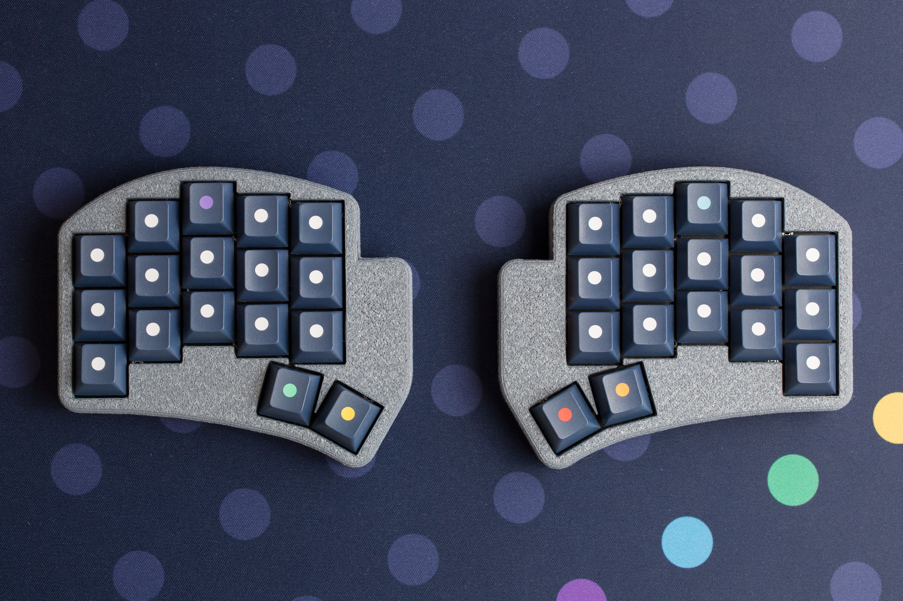
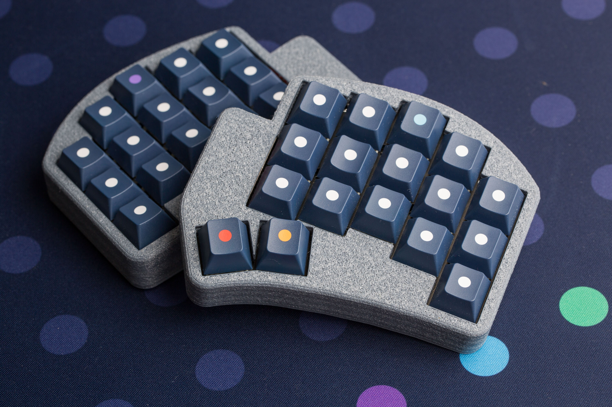
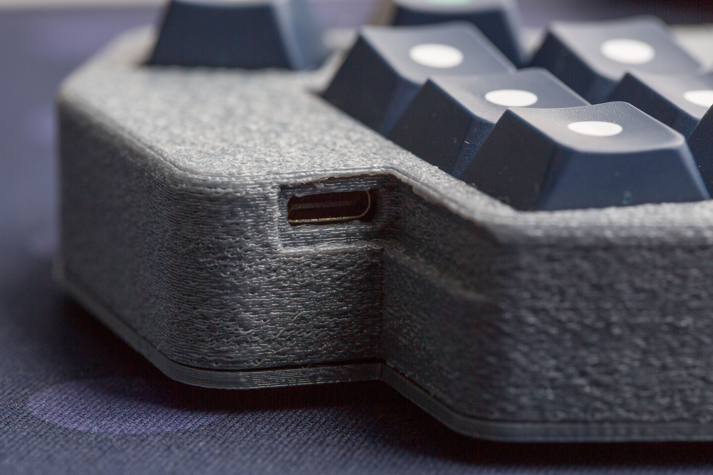
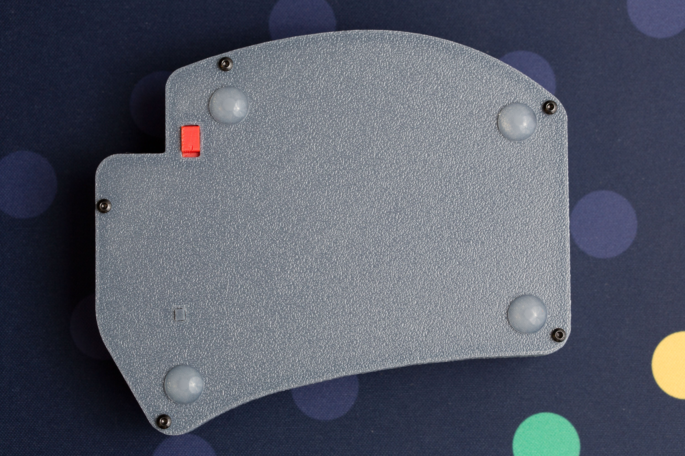
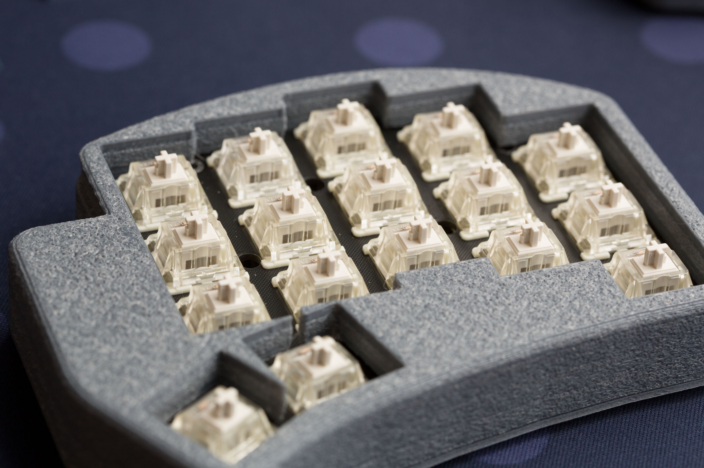
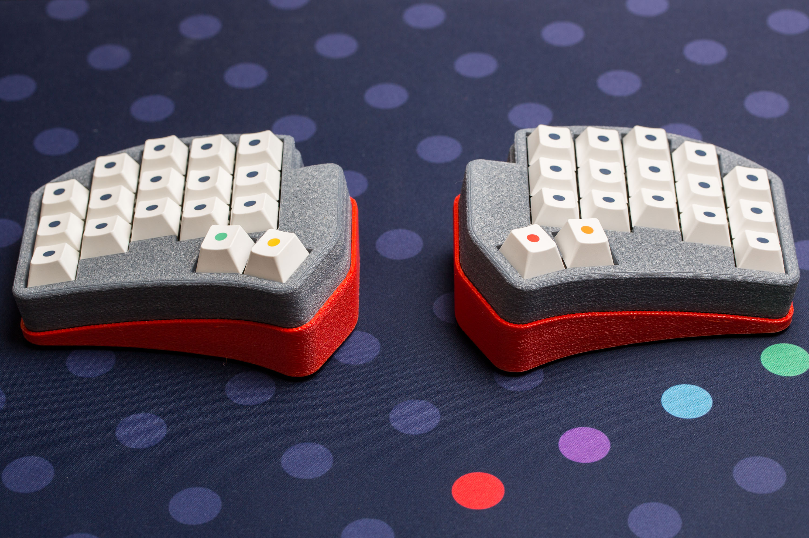

# Ferris-Sweep-Bling-MX-Case
A customizable, 3D-print-friendly case designed in OpenSCAD – fully parametric for easy sizing, modification, and rapid prototyping.

**Features**

* **Fully enclosed, professional design** – clean look with no exposed internals
* **USB-C port access** – plug in without removing the case
* **Integrated controls** – built-in slider for power switch and reset button
* **Vibration-dampened** – TPU-printable switch plate and bottom damper for reduced noise
* **Easy PCB insertion** – no need to remove switches or keycaps
* **Secure bottom lid** – mounted with heat-set M2 threaded inserts
* **Refined acoustics** – quiet, pleasant typing sound
* **Configurable tenting (new in v1.2.0)** – adjustable tent angle for a more ergonomic hand position

|  |  |
|--------------------------|--------------------------|
|  |  |
|  |  |

---

📦 **Download & Print**  
This model is also available on [MakerWorld](https://makerworld.com/de/models/1706706-ferris-sweep-bling-mx-case#profileId-1811389).
