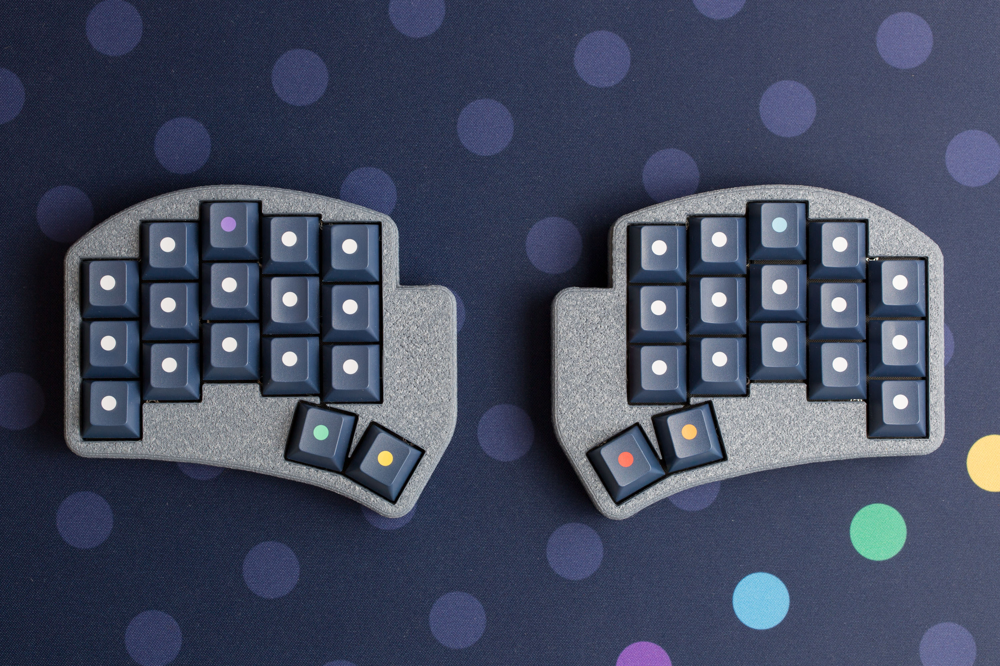
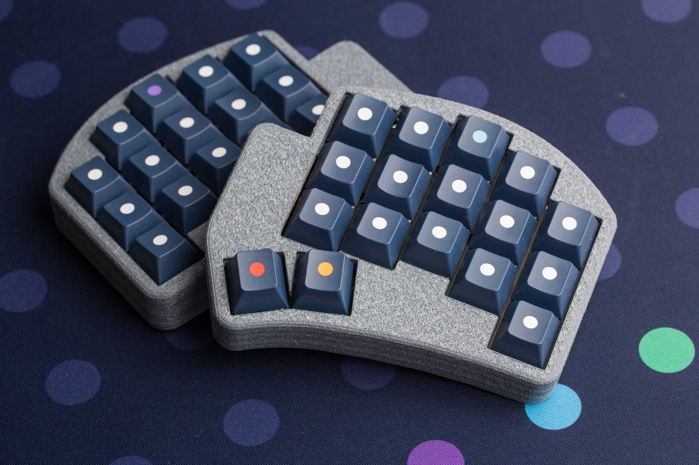
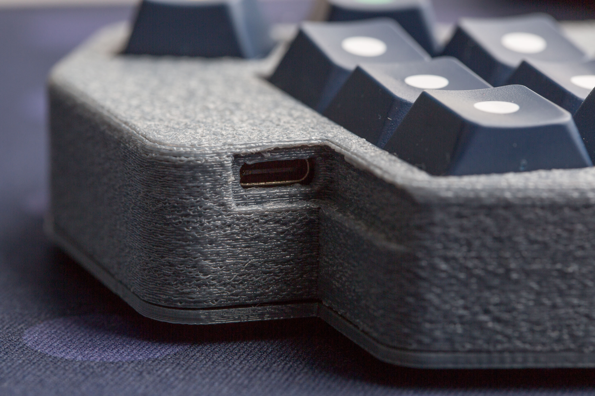
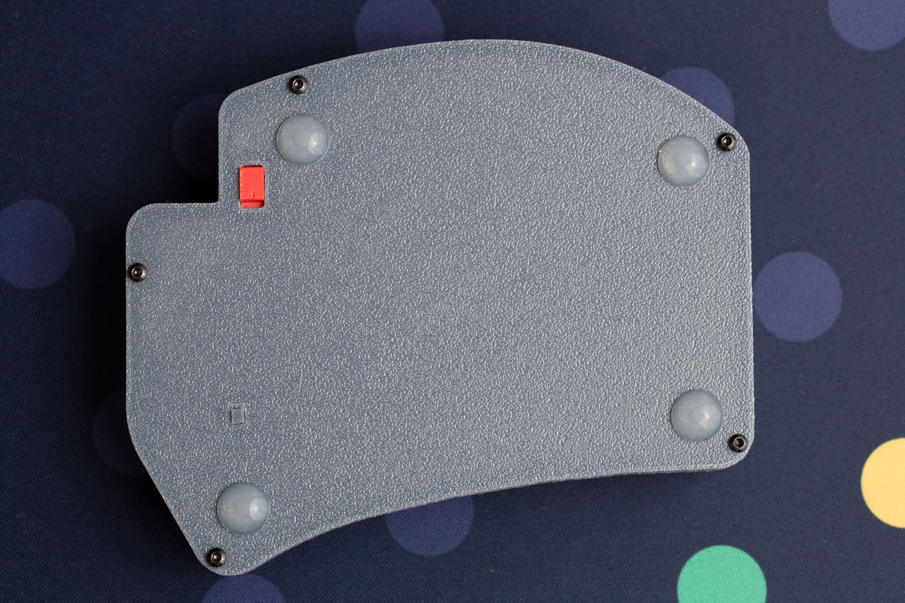
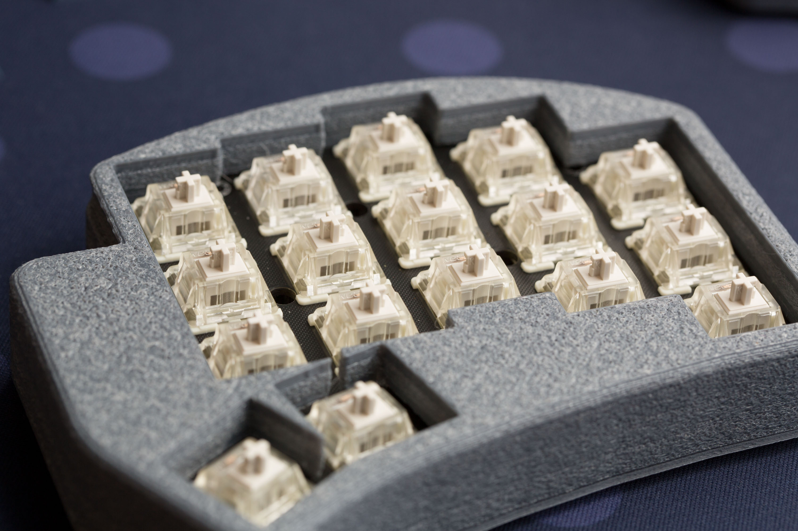
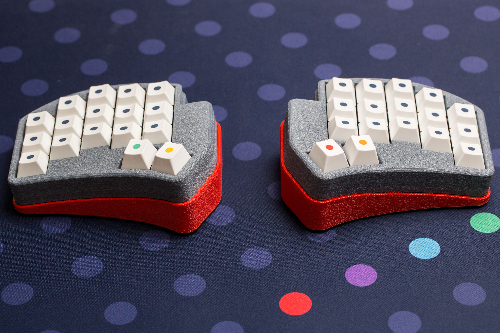
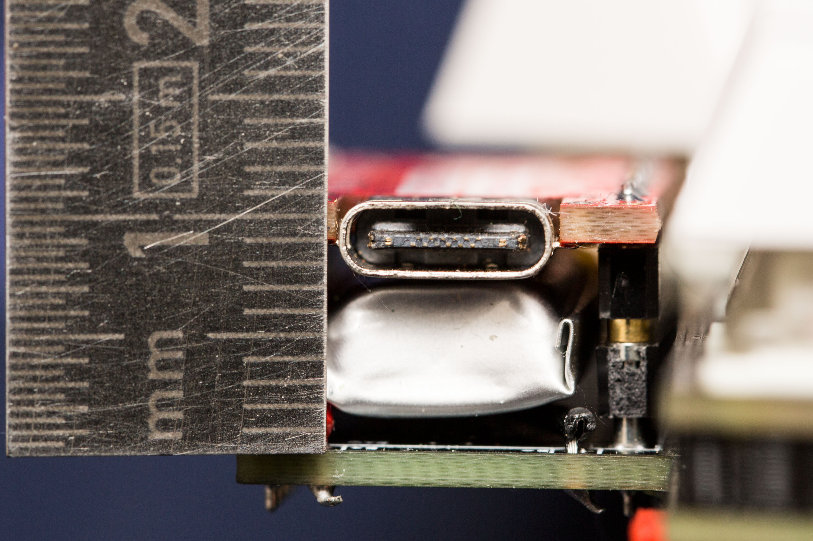

# Ferris-Sweep-Bling-MX-Case
A customizable, 3D-print-friendly case designed in OpenSCAD – fully parametric for easy sizing, modification, and rapid prototyping.


**V2 update:** Complete design refactor to a more professional architecture with a dedicated upper and lower tray. The PCB is now gasket-mounted via switch-plate tabs for improved isolation, acoustics, and typing feel.

**Features**

* **Fully enclosed, professional design** – clean look with no exposed internals
* **USB-C port access** – plug in without removing the case
* **Integrated controls** – built-in slider for power switch and reset button
* **Vibration-dampened** – TPU-printable switch plate and bottom damper for reduced noise
* **Easy PCB insertion** – no need to remove switches or keycaps
* **Secure bottom lid** – mounted with heat-set M2 threaded inserts
* **Refined acoustics** – quiet, pleasant typing sound
* **Configurable tenting (new in v1.2.0)** – adjustable tent angle for a more ergonomic hand position


|  |  |
|--------------------------|--------------------------|
|  |  |
|  |  |

---

📦 **Download & Print**  
This model is also available on [MakerWorld](https://makerworld.com/de/models/1706706-ferris-sweep-bling-mx-case#profileId-1811389).

# Getting Started

## Wired Build

For a wired build, enable the TRRS cutouts in both case halves by uncommenting `trrs_cutout();` in `top_case()` and `bottom_case()`. If you are not using a power switch, you can comment out the power-switch cutouts.

## 🧭 Adjusting the USB Outlet

The position of the USB-C port depends on your keyboard’s solder pin configuration and controller setup.  
Two parameters in `case.scad` define how the USB outlet aligns with your PCB:

### 1. `pcb_usb_distance`
- **Definition:** Distance (in millimeters) from the **PCB surface** to the **center of the USB-C port**.  
- **How to measure:**  
  Measure from the PCB’s top surface to the midpoint of the USB-C connector’s shell. In the example below, the distance is **9 mm**.  
- **Purpose:** Ensures the port opening in the case aligns precisely with the USB connector.

<p align="center">
  <br>
  <em>Example measurement — 9 mm from PCB to USB-C port center</em>
</p>

### 2. `controller_wall_thickness` *(optional)*
- **Definition:** Thickness of the **wall above the controller area**, directly over the USB port.  
- **Default:** Currently set to **1 mm** (`controller_wall_thickness = 1`).  
- **Adjustment:** Increase if the wall is too thin or if your controller sits deeper than expected.

### 🔧 To Adjust
1. Open `case.scad` in **OpenSCAD**.  
2. Find and edit the parameters:
   ```scad
   pcb_usb_distance = <your measured value>;         // e.g. 9
   controller_wall_thickness = <desired thickness>;  // e.g. 1.5
