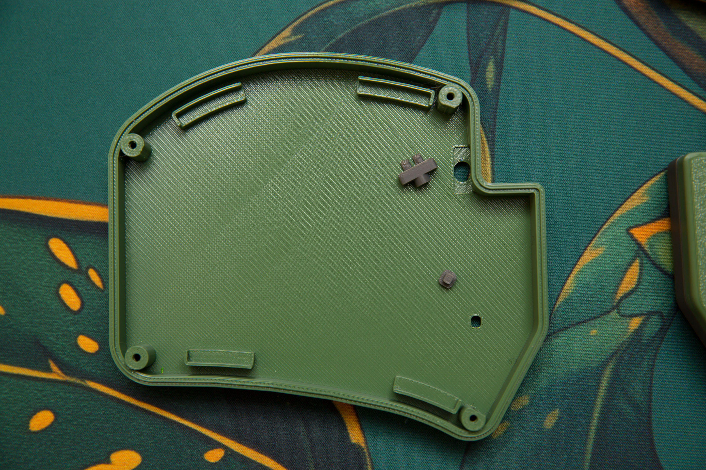
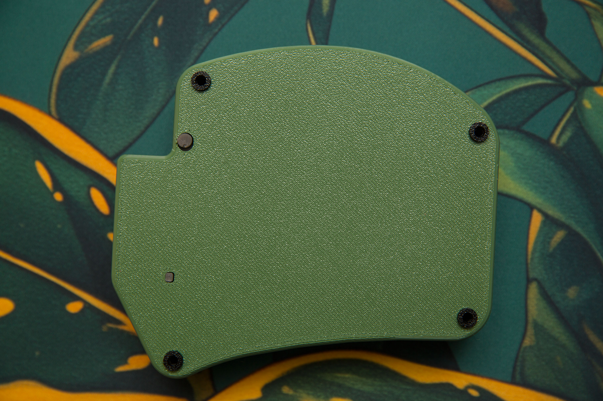
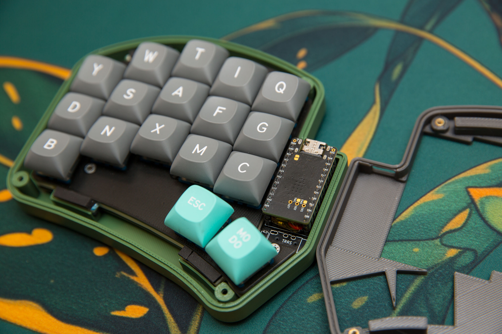
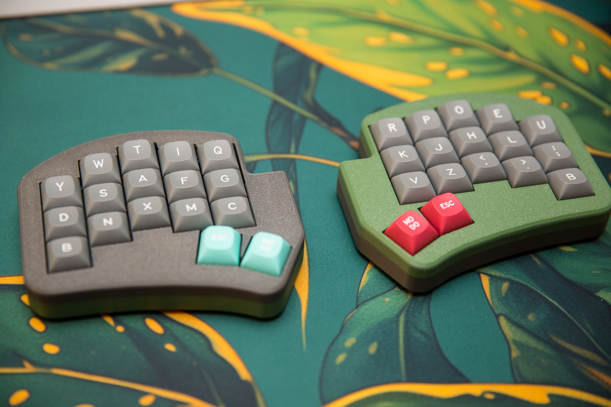
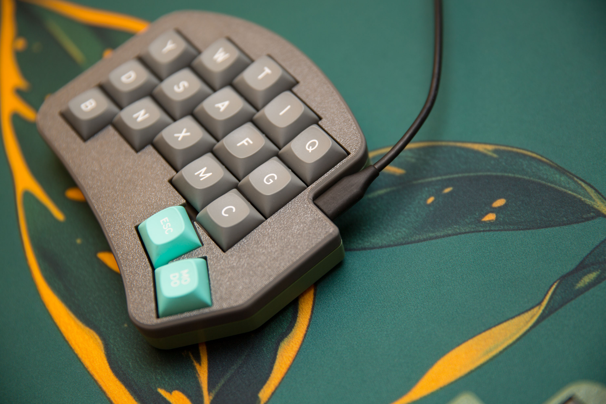

# Ferris Sweep Bling MX Case

Fully enclosed, parametric OpenSCAD case for the Ferris Sweep (MX), built for clean looks, practical assembly, and solid acoustics.

This project targets makers who already know keyboard basics, so the guide focuses on the case-specific decisions and build flow.

## V2.1.0 Highlights

- Complete architecture refactor with dedicated top and bottom trays.
- Gasket-mounted PCB via switch-plate tabs for better isolation and typing feel.
- Accessible USB-C opening without removing the case.
- Integrated slider and reset access support.
- Heat-set insert bottom mounting for repeatable service and teardown.

## Gallery

|  |  |
|---------------------------------|---------------------------------|
|  |  |
|  |  |

## MakerWorld

Download the latest release here:

[Ferris Sweep Bling MX Case v2.1.0 - MakerWorld](https://makerworld.com/de/models/2952710-ferris-sweep-bling-mx-case-v2-1-0#profileId-3308661)

## Repository Contents

- `case/case.scad` - main parametric model.
- `case/ferris_sweep_bling_mx.dxf` - reference 2D geometry.
- `gallery/` - build photos and reference images.

## Print Recommendations

- Material:
  - PLA/PETG for top and bottom case parts.
  - TPU for feet
- Supports:
  - Use tree supports on upper and lower parts for screw holes and USB opening.
- Usual quality baseline:
  - 0.2 mm layers, 1 to 2 walls, 15% to 25% infill.

## Hardware

- M2 heat-set inserts for the bottom mount points.
- Matching M2 screws for lid attachment.
- Ferris Sweep MX PCB including fr4 switchplate.

Heat-set and screw dimentions can be parameterized.

## Build Flow

1. Print case parts and clean support interfaces.
2. Install heat-set inserts in the top mounting points.
3. Test-fit PCB and confirm USB opening alignment before final assembly.
4. Close case with M2 screws and verify key travel/reset access.
5. Install TPU feet; Screws should still be accessable through hole.

## Wired Build Option

For a wired build, enable TRRS cutouts in both halves by uncommenting `trrs_cutout();` in:

- `top_case()`
- `bottom_case()`

If you are not using a power switch, comment out the power-switch cutouts.

## Adjusting USB Height and Outlet Alignment

USB-C position depends on your PCB/controller stack-up. In `case.scad`, two parameters control alignment:

### 1) `pcb_usb_distance`

- Definition: Distance in mm from PCB surface to USB-C port center.
- Purpose: Aligns the case outlet with the connector.
- How to measure: Measure from PCB top face to the middle of the USB-C shell.

<p align="center">
  <br>
  <em>Example: 9 mm from PCB to USB-C center</em>
</p>

### 2) `controller_wall_thickness` (optional)

- Definition: Wall thickness above the controller area near the USB opening.
- Default: `controller_wall_thickness = 1`.
- Use case: Increase if the wall is too thin for your controller placement.

### Parameter Example

```scad
pcb_usb_distance = 9;
controller_wall_thickness = 1.5;
```

Tip: print a short USB/controller test section first if your setup differs from common Ferris Sweep builds.
